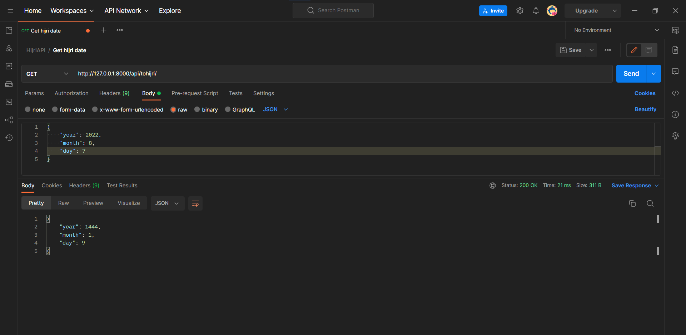
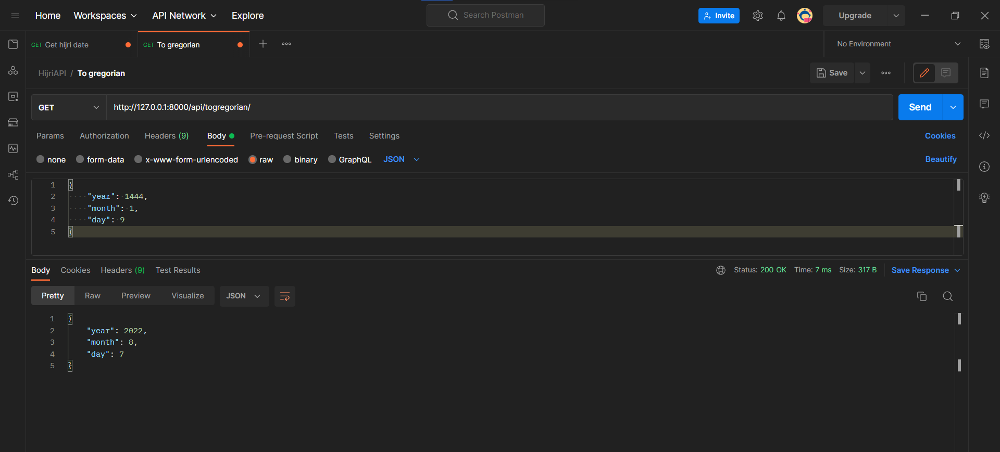
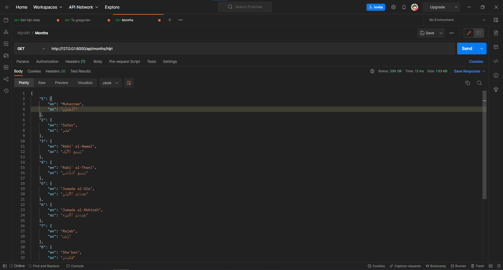
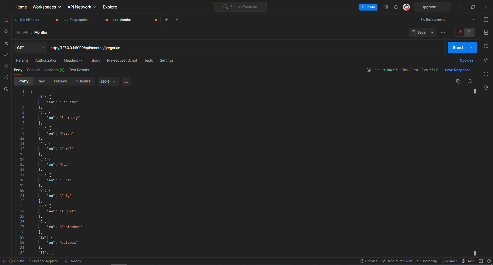
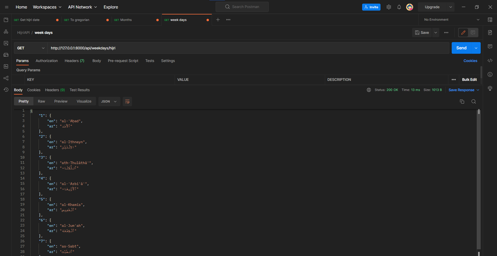
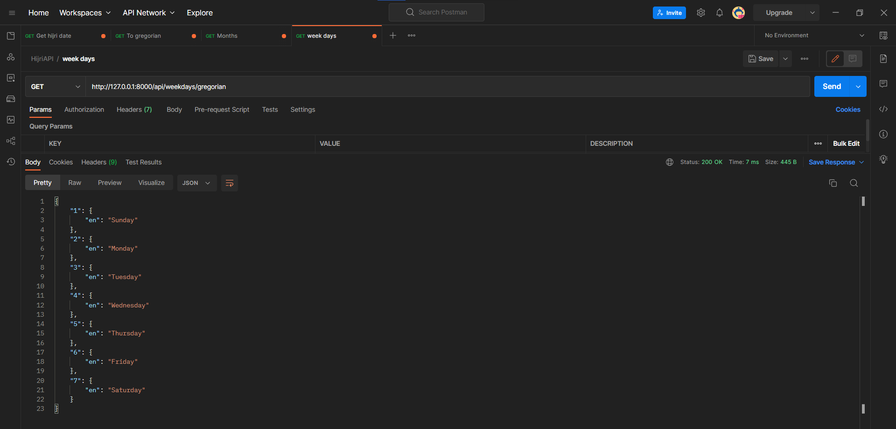
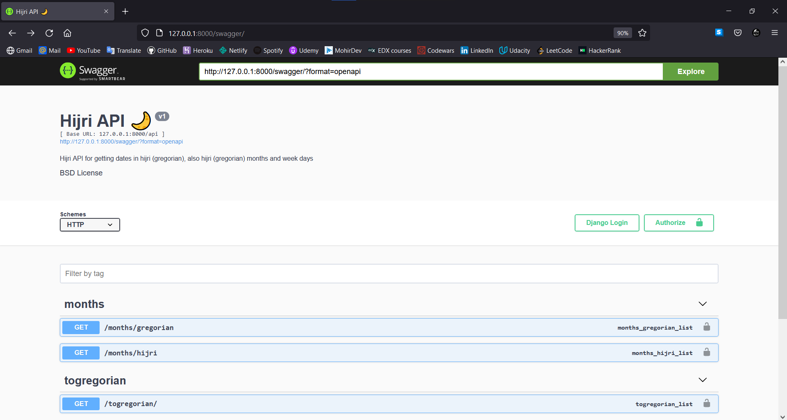
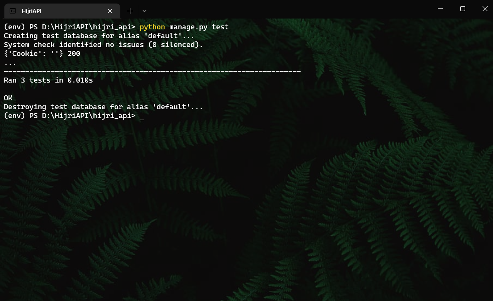

<div align="center">

  
  <h1>Hijri API🌙</h1>
  
</div>

## :star2: About the Project
Hijri API for getting dates in hijri (gregorian), also hijri (gregorian) months and week days😊
> P.S. I used <a href="https://pypi.org/project/hijri-converter/"> hijri-converter </a> package to get dates, big thanks author of this package


<!-- Env Variables -->
## :key: Secret key

To run this project, you need to add your generated secret key in settings.py file on `INSTALLED_APPS`. You can get it by this commands:

go terminal `$ django-admin shell` and type

```bash
from django.core.management.utils import get_random_secret_key  
get_random_secret_key()
```

or simply get it by <a href="https://djecrety.ir/">Djecrety</a>

<!-- Installation -->
## :gear: Installation

Clone the project

```bash
  git clone https://github.com/FarizAbduhakimov/HijriAPI.git
```

Create virtual env & activate it

```bash
  virtualenv env # create
  .\env\Scripts\activate # activate (Windows)
  
  $ source venv/bin/activate # activate (Linux)
```

Install requirements.txt 

```bash
pip install -r requirements.txt 
```
> For linux & mac use pip3 & python3


## :running: Run Locally

Go to the project directory & run

```bash
  cd .\hijri_api\
  
  python manage.py runserver
```

<!-- Usage -->
## :eyes: Usage

Go postman and continue following commands

<!-- Screenshots -->
<div align="center"> 
  
  <p>For getting hijri date type on url http://127.0.0.1:8000/api/tohijri and make a request, like that</p>
</div>


<div align="center"> 
  
  <p>So you can get gregorian date</p>
</div>

### For getting hijri (gregorian) months & week days

<div align="center"> 
  
  <p>Hijri months📅</p>
</div>

<div align="center"> 
  
  <p>Gregorian months📅</p>
</div>

<div align="center"> 
  
  <p>Hijri week days</p>
</div>

<div align="center"> 
  
  <p>Gregorian week days</p>
</div>

<!-- Swagger -->

## 🖼Swagger UI
Swagger url: `http://127.0.0.1:8000/swagger/`
<div align="center"> 
  
</div>

<!-- Running Tests -->
## :test_tube: Running Tests

To run tests, run the following command

```bash
  python manage.py test
```

<div align="center"> 
  
</div>


### Thanks 🙂
If you liked the project, don't forget to press a star button :)
